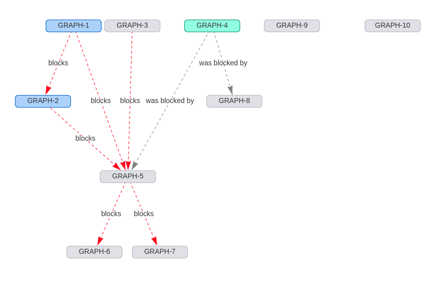

# sprint-graph

A Chrome plugin to visualize Jira tickets.

Currently _very_ rough.

## Why?

Jira's good at showing issues in lists and columns, but it's often hard to see
how issues relate to each other. With this Chrome plugin, you can visualize a
sprint as a graph:

Including both blockers and subtask relationships:

## Installation

This extension is still very rough, so hasn't yet been submitted to the Chrome
store. If you'd still like to install it:

1. Clone this repository
2. Run `make build`
3. On (chrome://extensions)[chrome://extensions], in development mode, load the
   created `build` directory as an unpacked extension.

## License

MIT
