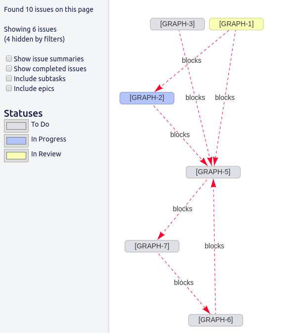
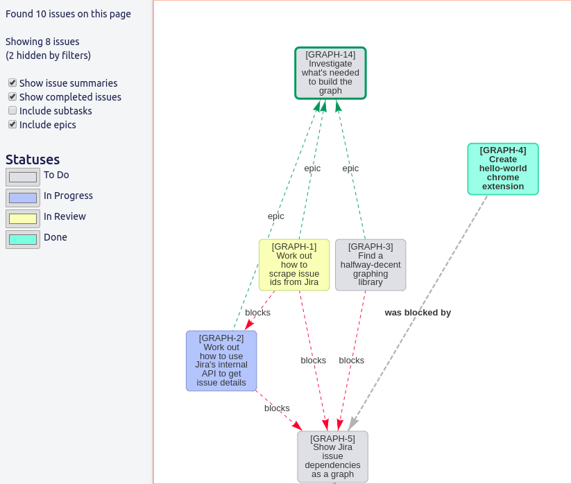
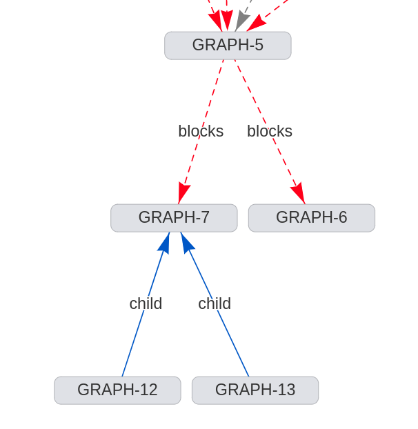

# sprint-graph

A Chrome extension to visualize how Jira issues relate to each other.

## Why?

Jira's good at showing issues in lists and columns, but it's often hard to see
at a glance:

- Which issues are blocked
- How many parallel work streams there are for a sprint or an epic
- Which issues are currently blocking the most work

With this extension, you can visualize a sprint as a graph, making it much
easier to determine how interdependent issues are.

In addition, you can visualize:

Epic hierarchies:

Subtask hierarchies:

## Installation

### Load the unpacked extension

To install this locally:

1. Clone this repository
2. Run `make build`
3. On (chrome://extensions)[chrome://extensions], in development mode, load the
   created `build` directory as an unpacked extension.

## Development

1. Follow the instructions above for loading the unpacked extension.
2. Run `make start` to run a development server that will automatically
   recompile after any file change and reload the extension and browser page.

## License

MIT
